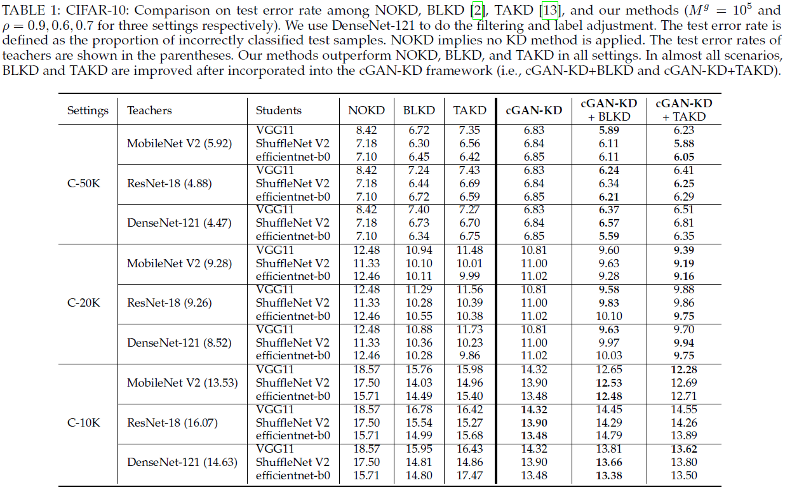
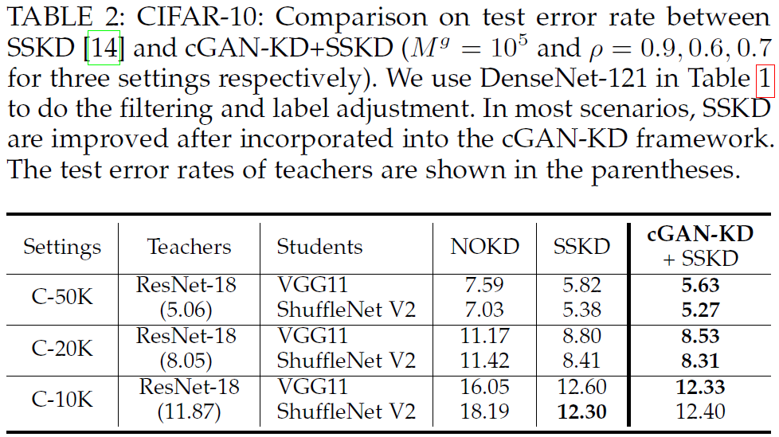
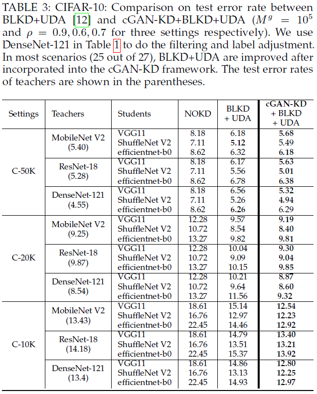
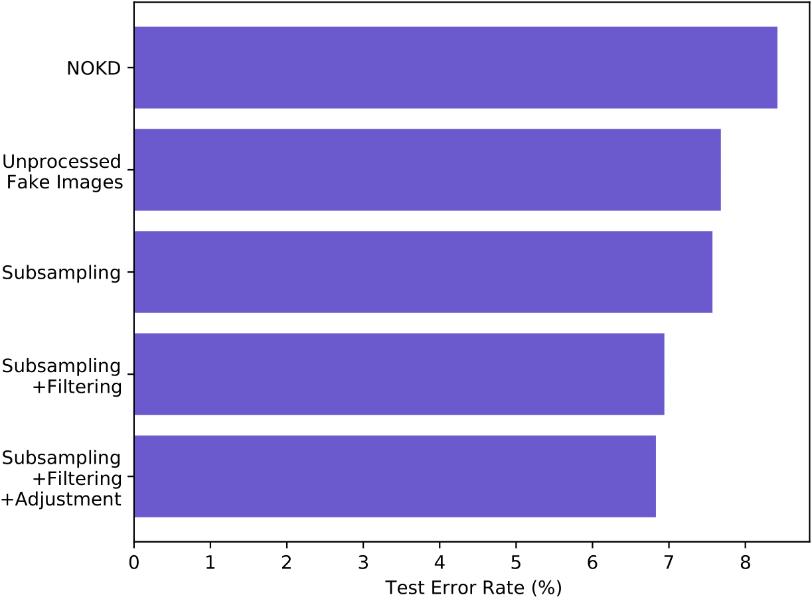
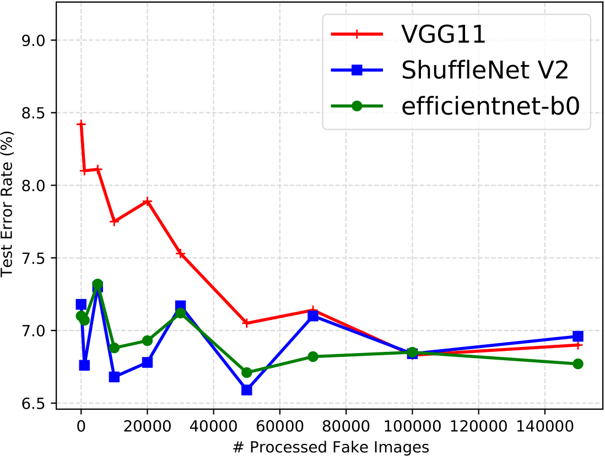
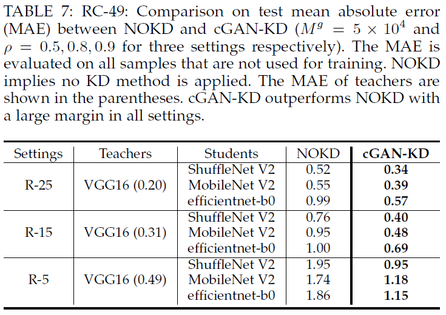
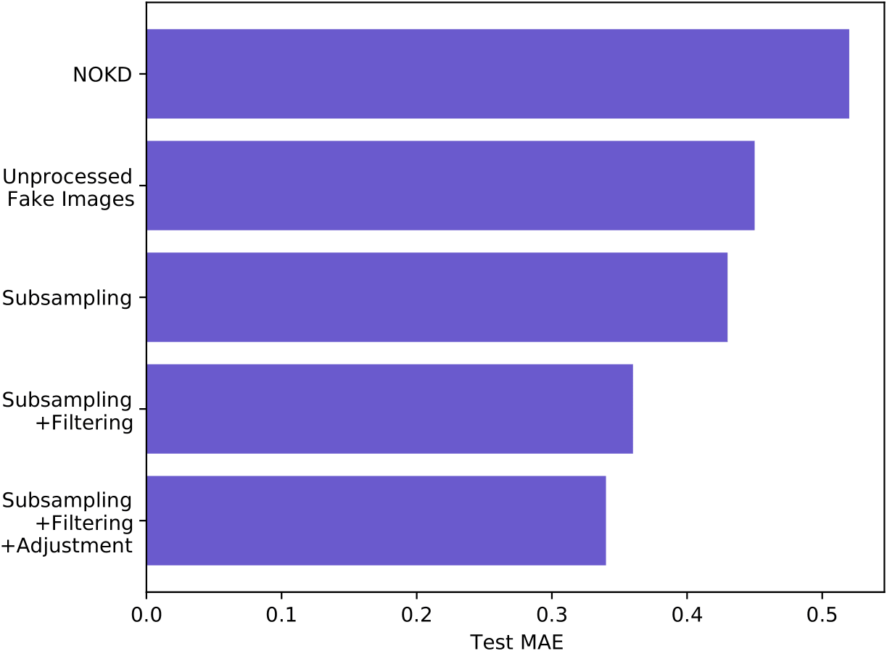
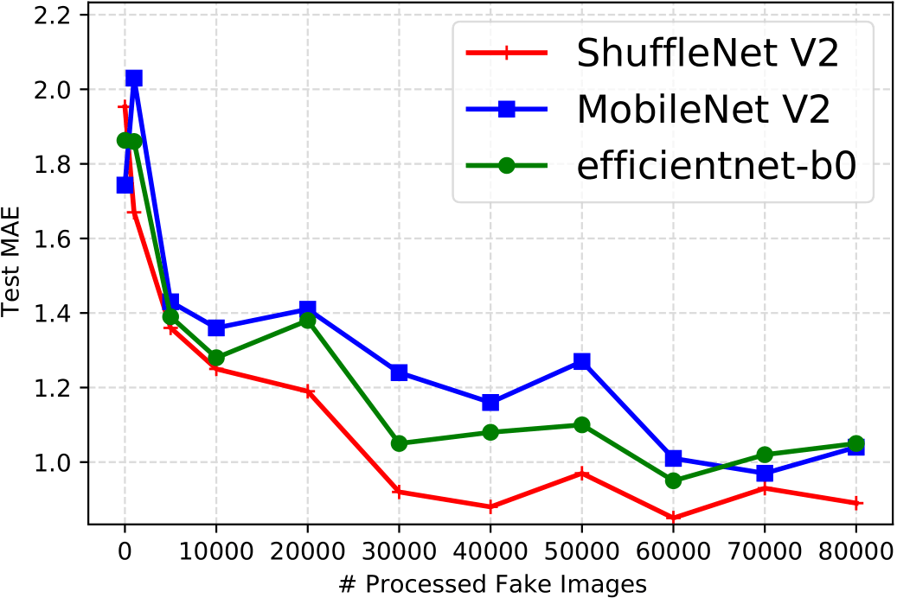

# cGAN-KD: Distill and Transfer Knowledge via cGAN-generated Samples

This repository provides the source codes for the experiments in our paper on the CIFAR-10 and RC-49 datasets. <br />
If you use this code, please cite
```text

TO BE DONE...

```


<p align="center">
  
  The workflow of cGAN-KD.
</p>


<p align="center">
  
  Evolution of fake samples' distributions and datasets.
</p>


-------------------------------

## Requirements
argparse>=1.1, h5py>=2.10.0, matplotlib>=3.2.1, numpy>=1.18.5, Pillow>=7.0.0, python=3.8.5, torch>=1.5.0, torchvision>=0.6.0,
tqdm>=4.46.1


-------------------------------

## Datasets (h5 files) and necessary checkpoints
Download and unzip `cGAN-KD_data_and_ckpts.7z`:  <br />
https://1drv.ms/u/s!Arj2pETbYnWQsswJMICWpCw20wsP1g?e=8tLRwB <br />

Then, transfer files or folders in `cGAN-KD_data_and_ckpts` to this github repo as follows.  <br />

Put `./C-X0K/CIFAR10_trainset_X0000_seed_2020.h5` at `./CIFAR_X0K/cGAN-based_KD/data/`. <br />
Put `./C-X0K/C10_2020.hdf5` at `./CIFAR_X0K/BigGAN/data/`. <br />
Put `./C-X0K/UDA_pretrained_teachers/*.pth` at `./CIFAR_X0K/Distiller/pretrained/`. <br />
Put `./C-X0K/ckpt_BigGAN_cifar10_ntrain_X0000_seed_2020` at `./CIFAR_X0K/cGAN-based_KD/Output_CIFAR10/saved_models/`. <br />
X stands for 5, 2, 1, representing C-50K, C-20K, and C-10K respectively. <br />

Put `./Tiny-ImageNet/tiny-imagenet-200.h5` at `./Tiny-ImageNet/cGAN-based_KD/data/`. <br />
Put `./Tiny-ImageNet/UDA_pretrained_teachers/*.pth` at `./Tiny-ImageNet/Distiller/pretrained/`. <br />
Put `./Tiny-ImageNet/BigGAN_weights` at `./Tiny-ImageNet/cGAN-based_KD/output/saved_models/`. <br />

Put `./RC-49/dataset` at `./RC-49`. <br />
Put `./RC-49/output` at `./RC-49/CcGAN-based_KD`. <br />
The `output/saved_models` folder includes the pretrained CcGAN (SNGAN arch), label embedding networks, a sparse autoencoder for feature extraction, a MLP-5 for conditional density ratio estimation, and the teacher model VGG16. <br />

Put `./UTKFace/dataset` at `./UTKFace`.  <br />
Put `./UTKFace/output` at `./UTKFace/CcGAN-based_KD/`.  <br />
The `output/saved_models` folder includes the pretrained CcGAN (SAGAN arch), label embedding networks, a sparse autoencoder for feature extraction, a MLP-5 for conditional density ratio estimation, and the teacher model VGG16. <br />

-------------------------------
## Sample Usage
### CIFAR-10
The codes for C-50K, C-20K, and C-10K are in `./CIFAR/CIFAR_50K`, `./CIFAR/CIFAR_20K`, and `./CIFAR/CIFAR_10K` respectively. We only take C-50K as an example to show how to run the experiment.

#### BigGAN training
The implementation of BigGAN is mainly based on [3].  <br />
Run `./CIFAR/CIFAR_50K/BigGAN/scripts/launch_cifar10_ema.sh` for C-50K (50,000 samples).  <br />
<!-- Run `./CIFAR/CIFAR_20K/BigGAN/scripts/launch_cifar10_ema.sh` for C-20K (20,000 samples).  <br />
Run `./CIFAR/CIFAR_10K/BigGAN/scripts/launch_cifar10_ema.sh` for C-10K (10,000 samples).  <br /> -->
Checkpoints of BigGAN used in our experiments are in `cGAN-KD_data_and_ckpts.7z`.  <br />

#### Fake data generation
Run `./CIFAR/CIFAR_50K/cGAN-based_KD/scripts/run_gen_synt_data.sh` for C-50K (50,000 samples).  <br />
<!-- Run `./CIFAR/CIFAR_20K/cGAN-based_KD/scripts/run_gen_synt_data.sh` for C-20K (20,000 samples).  <br />
Run `./CIFAR/CIFAR_10K/cGAN-based_KD/scripts/run_gen_synt_data.sh` for C-10K (10,000 samples).  <br /> -->
`filtering_threshold` in `run_gen_synt_data.sh` controls the filtering threshold.  <br />
`NFAKE_PER_CLASS` in `run_gen_synt_data.sh` controls the number of fake images generated for each class. <br />
Generated fake data are stored in `./CIFAR/CIFAR_50K/cGAN-based_KD/data` in the h5 format. <br />
Note that before the fake data generation, make sure you train the teacher model first via running  `./CIFAR/CIFAR_50K/cGAN-based_KD/scripts/run_nokd.sh`.

#### Grid search for selecting the optimal rho
Run `./CIFAR/CIFAR_50K/cGAN-based_KD/scripts/run_rho_selection.sh` <br />
`FAKE_DATASET_NAME` specifies the fake dataset generated with different rho, which in the format of 'BigGAN_..._nfake_xxx'. <br />
Modify `FAKE_DATASET_NAME` to test the performance of student models under different rho's.  <br />

#### NOKD, BLKD, TAKD, cGAN-KD, cGAN-KD+BLKD, cGAN-KD+TAKD
NOKD: run `./CIFAR/CIFAR_50K/cGAN-based_KD/scripts/run_nokd.sh` <br />
BLKD: run `./CIFAR/CIFAR_50K/cGAN-based_KD/scripts/run_blkd.sh` <br />
TAKD: run `./CIFAR/CIFAR_50K/cGAN-based_KD/scripts/run_takd.sh` <br />
cGAN-KD: run `./CIFAR/CIFAR_50K/cGAN-based_KD/scripts/run_nokd_fake.sh` <br />
cGAN-KD+BLKD: run `./CIFAR/CIFAR_50K/cGAN-based_KD/scripts/run_blkd_fake.sh` <br />
cGAN-KD+TAKD: run `./CIFAR/CIFAR_50K/cGAN-based_KD/scripts/run_takd_fake.sh` <br />

#### SSKD and cGAN-KD+SSKD
NOKD: run `./CIFAR/CIFAR_50K/SSKD/scripts/run_nokd.sh` <br />
SSKD: run `./CIFAR/CIFAR_50K/SSKD/scripts/run_SSKD.sh` <br />
cGAN-KD+SSKD: run `./CIFAR/CIFAR_50K/SSKD/scripts/run_SSKD+fake.sh` <br />

#### BLKD+UDA and cGAN-KD+BLKD+UDA
NOKD: run `./CIFAR/CIFAR_50K/Distiller/scripts/run_nokd.sh` <br />
BLKD+UDA: run `./CIFAR/CIFAR_50K/Distiller/scripts/run_blkd+uda.sh` <br />
cGAN-KD+BLKD+UDA: run `./CIFAR/CIFAR_50K/Distiller/scripts/run_blkd+uda+fake.sh` <br />


### Tiny-ImageNet
#### BigGAN training
We provide the checkpoints of BigGAN used in the experiment in `cGAN-KD_data_and_ckpts.7z`.  <br />

#### Fake data generation
Run `./Tiny-ImageNet/cGAN-based_KD/scripts/run_gen_synt_data.sh` for C-50K (50,000 samples).  <br />
`filtering_threshold` in `run_gen_synt_data.sh` controls the filtering threshold.  <br />
`NFAKE_PER_CLASS` in `run_gen_synt_data.sh` controls the number of fake images generated for each class. <br />

#### Grid search for selecting the optimal rho
Run `./Tiny-ImageNet/cGAN-based_KD/scripts/run_rho_selection.sh` <br />
`FAKE_DATASET_NAME` specifies the fake dataset generated with different rho, which in the format of 'BigGAN_..._nfake_xxx'. <br />
Modify `FAKE_DATASET_NAME` to test the performance of student models under different rho's.  <br />

#### NOKD, BLKD, TAKD, cGAN-KD, cGAN-KD+BLKD, cGAN-KD+TAKD
NOKD: run `./Tiny-ImageNet/cGAN-based_KD/scripts/run_nokd.sh` <br />
BLKD: run `./Tiny-ImageNet/cGAN-based_KD/scripts/run_blkd.sh` <br />
TAKD: run `./Tiny-ImageNet/cGAN-based_KD/scripts/run_takd.sh` <br />
cGAN-KD: run `./Tiny-ImageNet/cGAN-based_KD/scripts/run_nokd_fake.sh` <br />
cGAN-KD+BLKD: run `./Tiny-ImageNet/cGAN-based_KD/scripts/run_blkd_fake.sh` <br />
cGAN-KD+TAKD: run `./Tiny-ImageNet/cGAN-based_KD/scripts/run_takd_fake.sh` <br />

#### SSKD and cGAN-KD+SSKD
NOKD: run `./Tiny-ImageNet/SSKD/scripts/run_nokd.sh` <br />
SSKD: run `./Tiny-ImageNet/SSKD/scripts/run_SSKD.sh` <br />
cGAN-KD+SSKD: run `./Tiny-ImageNet/SSKD/scripts/run_SSKD+fake.sh` <br />

#### BLKD+UDA and cGAN-KD+BLKD+UDA
NOKD: run `./Tiny-ImageNet/Distiller/scripts/run_nokd.sh` <br />
BLKD+UDA: run `./Tiny-ImageNet/Distiller/scripts/run_blkd+uda.sh` <br />
cGAN-KD+BLKD+UDA: run `./Tiny-ImageNet/Distiller/scripts/run_blkd+uda+fake.sh` <br />


### RC-49
We only take R-25 as an example to show how to run the experiment.

#### CcGAN training and fake data generation
The implementation of CcGAN is mainly based on [1] and [2] but we change loss function to hinge loss.  <br />

Run `./RC49/CcGAN-based_KD/scripts/run_gen_r25.sh` for R-25 (25 images per angle).  <br />
<!-- Run `./RC49/CcGAN-based_KD/scripts/run_gen_r15.sh` for R-15 (15 images per angle).  <br />
Run `./RC49/CcGAN-based_KD/scripts/run_gen_r5.sh` for R-5 (5 images per angle).  <br /> -->
`filtering_threshold` controls the filtering threshold.  <br />

#### Grid search for selecting the optimal rho
Run `./RC49/CcGAN-based_KD/scripts/run_rho_selection_r25.sh` <br />
<!-- Run `./RC49/CcGAN-based_KD/scripts/run_rho_selection_r15.sh` <br />
Run `./RC49/CcGAN-based_KD/scripts/run_rho_selection_r5.sh` <br /> -->
`FAKE_DATASET_NAME` specifies the fake dataset's name, which in the 'GANNAME_..._nfake_xxx'. <br />
Modify `FAKE_DATASET_NAME` to test the performance of student models under different rho's.  <br />

#### NOKD and cGAN-KD
NOKD: run `./RC49/CcGAN-based_KD/scripts/run_nokd_r25.sh` <br />
cGAN-KD: run `./RC49/CcGAN-based_KD/scripts/run_nokd+fake_r25.sh` <br />


### UTKFace

#### CcGAN training and fake data generation
The implementation of CcGAN is mainly based on [1] and [2] but we use the SAGAN architecture and hinge loss.  <br />

Run `./UTKFace/CcGAN-based_KD/scripts/run_gen.sh`.  <br />
`filtering_threshold` controls the filtering threshold.  <br />

#### Grid search for selecting the optimal rho
Run `./UTKFace/CcGAN-based_KD/scripts/run_rho_selection.sh` <br />
`FAKE_DATASET_NAME` specifies the fake dataset's name, which in the 'GANNAME_..._nfake_xxx'. <br />
Modify `FAKE_DATASET_NAME` to test the performance of student models under different rho's.  <br />

#### NOKD and cGAN-KD
NOKD: run `./UTKFace/CcGAN-based_KD/scripts/run_nokd.sh` <br />
cGAN-KD: run `./UTKFace/CcGAN-based_KD/scripts/run_nokd_fake.sh` <br />


-------------------------------
## Some Results
* **CIFAR-10**
<p align="center">
  
  
  
  
  
</p>

* **RC-49**
<p align="center">
  
  
  
</p>


-------------------------------
## References
[1] X. Ding, Y. Wang, Z. Xu, W. J. Welch, and Z. J. Wang, “CcGAN: Continuous conditional generative adversarial networks for image generation,” in International Conference on Learning Representations, 2021.  <br />
[2] X. Ding, Y. Wang, Z. Xu, W. J. Welch, and Z. J. Wang, “Continuous conditional generative adversarial networks for image generation: Novel losses and label input mechanisms,” arXiv preprint arXiv:2011.07466, 2020. https://github.com/UBCDingXin/improved_CcGAN  <br />
[3] https://github.com/ajbrock/BigGAN-PyTorch <br />
[4] Ding, Xin, et al. "Efficient Subsampling for Generating High-Quality Images from Conditional Generative Adversarial Networks." arXiv preprint arXiv:2103.11166 (2021). https://github.com/UBCDingXin/cDRE-based_Subsampling_cGANS
