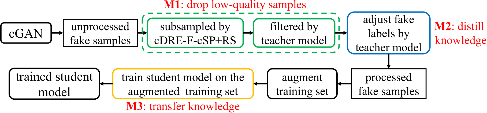
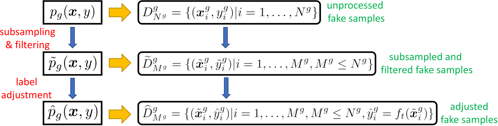
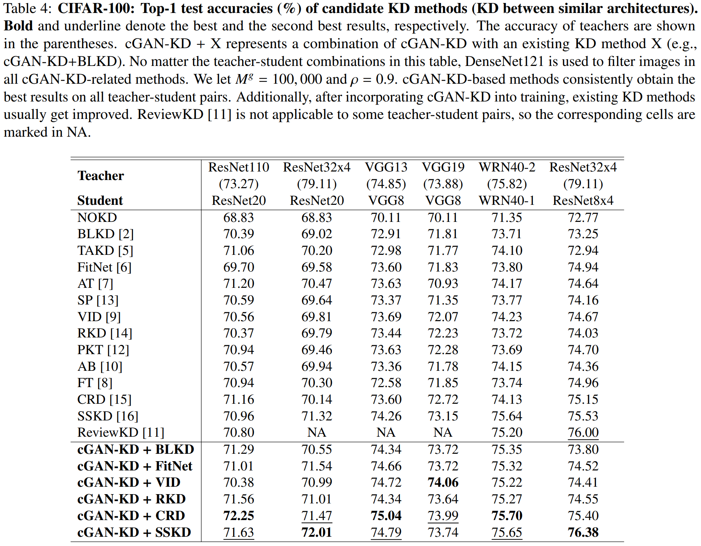
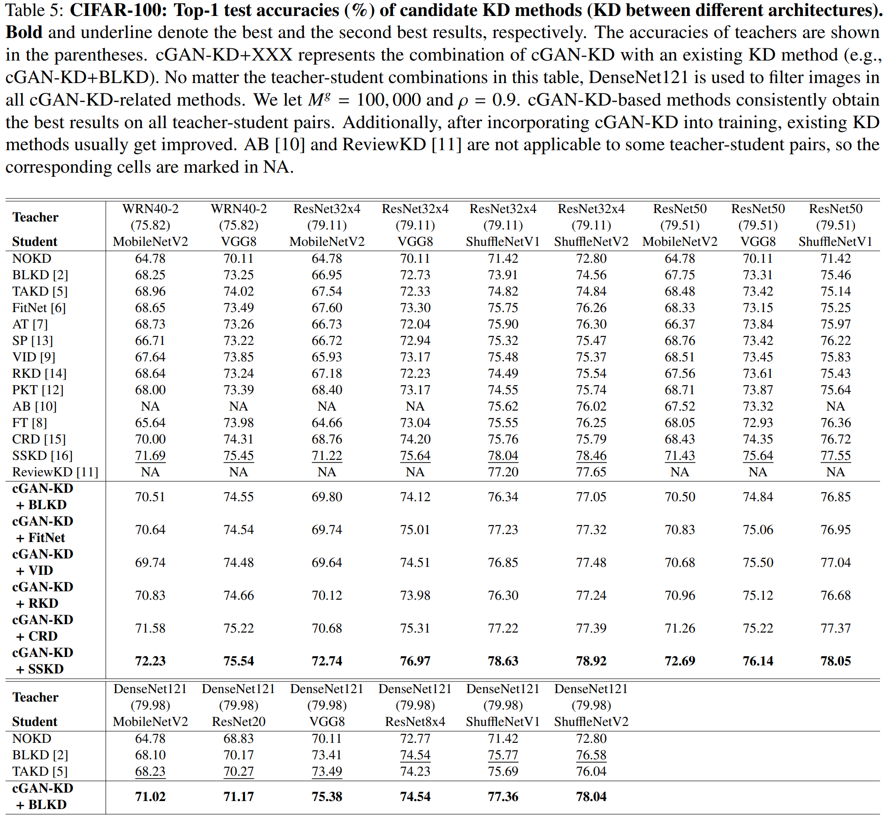
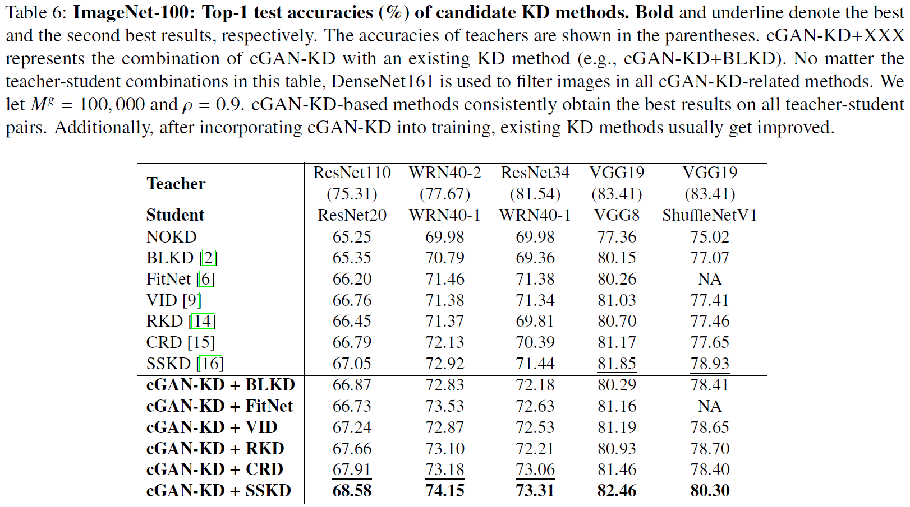
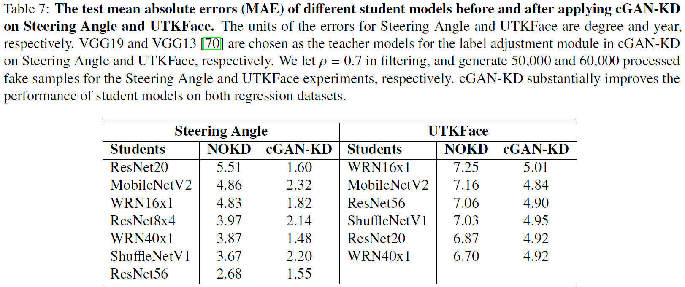
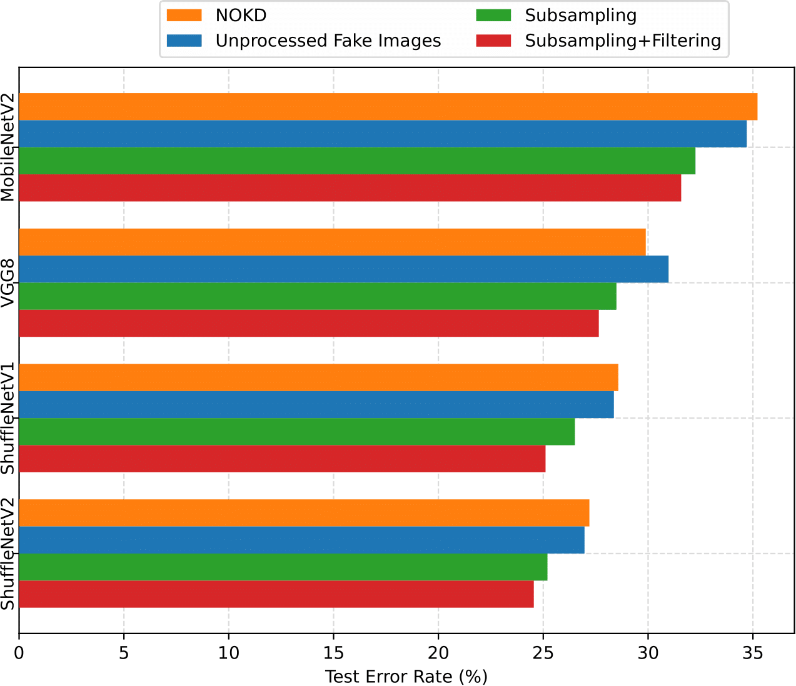
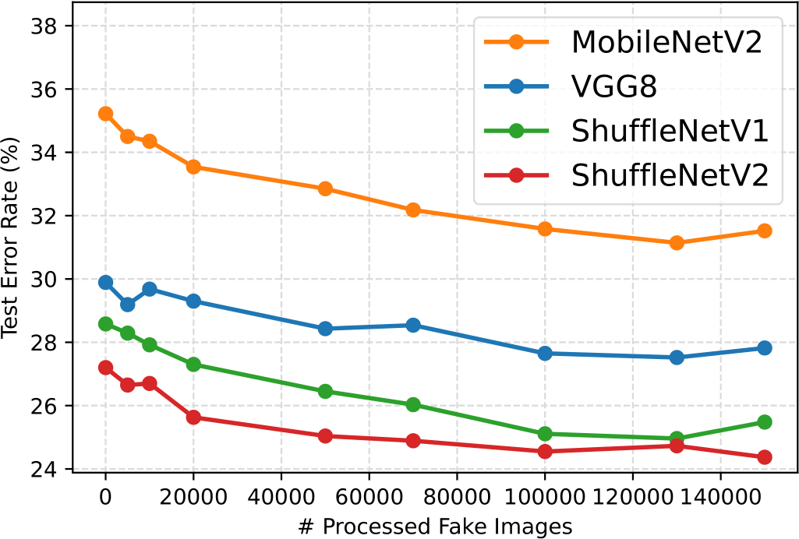
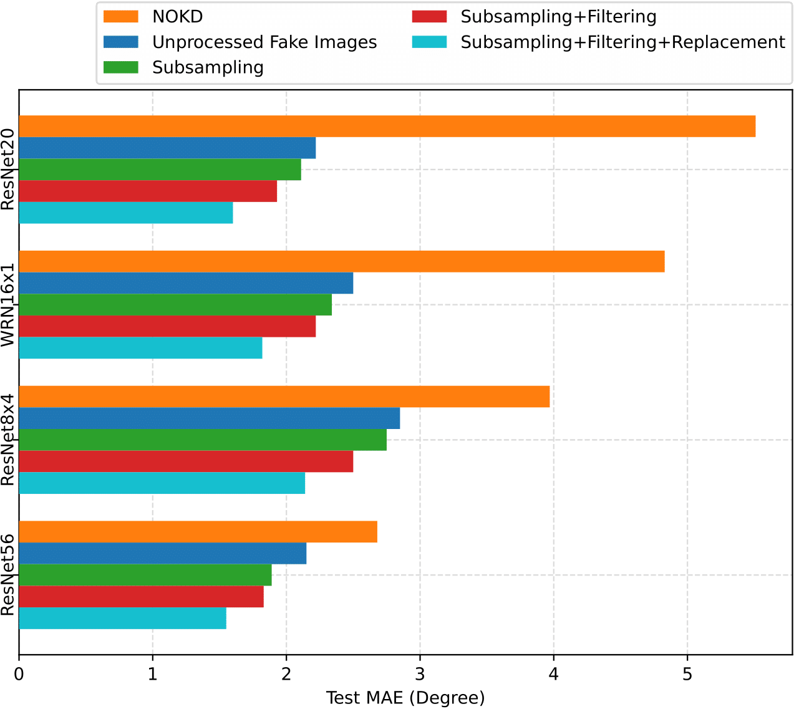
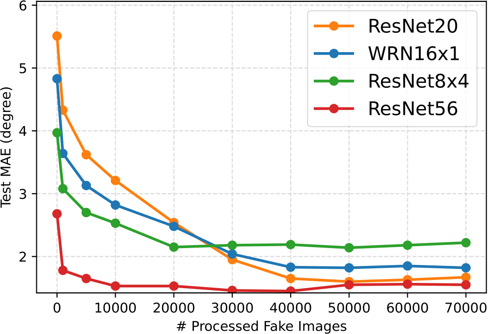

# Distilling and Transferring Knowledge via cGAN-generated Samples for Image Classification and Regression

This repository provides the source codes for the experiments in our paper at https://arxiv.org/abs/2104.03164. <br />
If you use this code, please cite
```text

@misc{ding2021distilling,
      title={Distilling and Transferring Knowledge via cGAN-generated Samples for Image Classification and Regression},
      author={Xin Ding and Z. Jane Wang and Zuheng Xu and Yongwei Wang and William J. Welch},
      year={2022},
      eprint={2104.03164v3},
      archivePrefix={arXiv},
      primaryClass={cs.CV}
}

```


<p align="center">
  
  The workflow of cGAN-KD.
</p>


<p align="center">
  
  Evolution of fake samples' distributions and datasets.
</p>

-------------------------------
## To Do List

- [x] CIFAR-100
- [x] ImageNet-100
- [x] Steering Angle
- [x] UTKFace


-------------------------------

## 1. Requirements
argparse>=1.1, h5py>=2.10.0, matplotlib>=3.2.1, numpy>=1.18.5, Pillow>=7.0.0, python=3.8.5, torch>=1.5.0, torchvision>=0.6.0,
tqdm>=4.46.1


-------------------------------

## 2. Datasets (h5 files) and necessary checkpoints

### 2.1. CIFAR-100
Download `eval_and_gan_ckpts.7z`:  <br />
https://1drv.ms/u/s!Arj2pETbYnWQuqt036MJ2KdVMKRXAw?e=4mo5SI <br />
Unzip `eval_and_gan_ckpts.7z` you will get `eval_and_gan_ckpts`. Then, put `eval_and_gan_ckpts` under `./CIFAR-100` <br />

### 2.2. ImageNet-100
#### 2.2.1 Dataset
Download `ImageNet_128x128_100Class.h5` from https://1drv.ms/u/s!Arj2pETbYnWQtoVvUvsC2xoh3swt4A?e=0PDCJo  <br />
Put this .h5 file at `./datasets/ImageNet-100`.

#### 2.1.2 Checkpoints
Download `eval_and_gan_ckpts.7z`:  <br />
https://1drv.ms/u/s!Arj2pETbYnWQuqwFLFR8_cf7tWKqtQ?e=o1sPe9 <br />
Unzip `eval_and_gan_ckpts.7z` you will get `eval_and_gan_ckpts`. Then, put `eval_and_gan_ckpts` under `./ImageNet-100` <br />

### 2.3. Steering Angle
Download `SteeringAngle_64x64_prop_0.8.h5` from https://1drv.ms/u/s!Arj2pETbYnWQudF7rY9aeP-Eis4_5Q?e=kBkS2P  <br />
Put this .h5 file at `./datasets/SteeringAngle`.

### 2.4. UTKFace
Download `UTKFace_64x64_prop_0.8.h5` from https://1drv.ms/u/s!Arj2pETbYnWQucRHFHhZtG9P1iXxpw?e=B6tQsS  <br />
Put this .h5 file at `./datasets/UTKFace`.


-------------------------------
## 3. Sample Usage

**Remember to correctly set all paths and other settings (e.g., TEACHER, STUDENT, and NFAKE) in .sh files correctly!**  <br />

### 3.1. CIFAR-100
#### 3.1.1. BigGAN training
The implementation of BigGAN is mainly based on [3,4].  <br />
Run `./CIFAR-100/BigGAN/scripts/launch_cifar100_ema.sh`.  <br />
Checkpoints of BigGAN used in our experiments are already in `cGAN-KD_data_and_ckpts.7z` (see 2.1. CIFAR-100).  <br />

#### 3.1.2. Fake data generation in `./CIFAR-100/make_fake_datasets`
Run `./CIFAR-100/make_fake_datasets/scripts/run.sh`.  <br />

#### 3.1.3. Train cnns without KD in `./CIFAR-100/RepDistiller`
Run `./CIFAR-100/RepDistiller/scripts/vanilla/run_vanilla.sh`

#### 3.1.4. Implement existing KD except SSKD, ReviewKD and TAKD in `./CIFAR-100/RepDistiller`
Run `./CIFAR-100/RepDistiller/scripts/distill/run_distill.sh`


#### 3.1.5. Implement TAKD in `./CIFAR-100/TAKD`
Run `./CIFAR-100/TAKD/scripts/distill/run_distill.sh`


#### 3.1.6. Implement SSKD in `./CIFAR-100/SSKD`
First, run `./CIFAR-100/SSKD/scripts/vanilla/run_vanilla.sh`.  <br />
Then, run `./CIFAR-100/SSKD/scripts/distill/run_distill.sh`


#### 3.1.7. Implement ReviewKD in `./CIFAR-100/ReviewKD`
Run `./CIFAR-100/ReviewKD/scripts/run_distill.sh`

#### 3.1.8. Implement cGAN-KD-based methods
##### 3.1.8.1 cGAN-KD only
Run `./CIFAR-100/RepDistiller/scripts/vanilla/run_vanilla_fake.sh`

##### 3.1.8.2 cGAN-KD + XXX
For cGAN-KD + BLKD/FitNet/VID/RKD/CRD, run `./CIFAR-100/RepDistiller/scripts/distill/run_distill_fake.sh` <br />
For cGAN-KD + SSKD, run `./CIFAR-100/SSKD/scripts/distill/run_distill_fake.sh` <br />


### 3.2. ImageNet-100
The implementation of BigGAN is mainly based on [3,4].  <br />
Checkpoints of BigGAN used in our experiments are already in `cGAN-KD_data_and_ckpts.7z` (see 2.2. ImageNet-100).  <br />

#### 3.2.1. Fake data generation in `./ImageNet-100/make_fake_datasets`
Run `./ImageNet-100/make_fake_datasets/scripts/run.sh`.  <br />

#### 3.2.2. Train cnns without KD in `./ImageNet-100/RepDistiller`
Run `./ImageNet-100/RepDistiller/scripts/vanilla/run_vanilla.sh`

#### 3.2.3. Implement existing KD except SSKD, ReviewKD and TAKD in `./ImageNet-100/RepDistiller`
Run `./ImageNet-100/RepDistiller/scripts/distill/run_distill.sh`


#### 3.2.4. Implement TAKD in `./ImageNet-100/TAKD`
Run `./ImageNet-100/TAKD/scripts/distill/run_distill.sh`


#### 3.2.5. Implement SSKD in `./ImageNet-100/SSKD`
First, run `./ImageNet-100/SSKD/scripts/vanilla/run_vanilla.sh`.  <br />
Then, run `./ImageNet-100/SSKD/scripts/distill/run_distill.sh`


#### 3.2.6. Implement ReviewKD in `./ImageNet-100/ReviewKD`
Run `./ImageNet-100/ReviewKD/scripts/run_distill.sh`

#### 3.2.7. Implement cGAN-KD-based methods
##### 3.2.7.1 cGAN-KD only
Run `./ImageNet-100/RepDistiller/scripts/vanilla/run_vanilla_fake.sh`

##### 3.2.7.2 cGAN-KD + XXX
For cGAN-KD + BLKD/FitNet/VID/RKD/CRD, run `./ImageNet-100/RepDistiller/scripts/distill/run_distill_fake.sh` <br />
For cGAN-KD + SSKD, run `./ImageNet-100/SSKD/scripts/distill/run_distill_fake.sh` <br />


### 3.3. Steering Angle
#### 3.3.1. CcGAN training and fake data generation
The implementation of CcGAN is mainly based on [1,2].  <br />
Run `./SteeringAngle/scripts/run_gene_data.sh`.  <br />

#### 3.3.2. Train cnns without KD
Run `./SteeringAngle/scripts/run_cnn.sh`

#### 3.3.3. Implement cGAN-KD-based methods
Run `./SteeringAngle/scripts/run_cnn_fake.sh`


### 3.4. UTKFace
The implementation of CcGAN is mainly based on [1,2].  <br />
Run `./SteeringAngle/scripts/run_gene_data.sh`.  <br />

#### 3.3.2. Train cnns without KD
Run `./SteeringAngle/scripts/run_cnn.sh`

#### 3.3.3. Implement cGAN-KD-based methods
Run `./SteeringAngle/scripts/run_cnn_fake.sh`


-------------------------------
## 4. Some Results

### 4.1. CIFAR-100
<p align="center">
  
  
</p>


### 4.2. ImageNet-100
<p align="center">
  
</p>

### 4.3. Steering Angle and UTKFace
<p align="center">
  
</p>

### 4.4. Ablation Study: CIFAR-100
<p align="center">
  
  
</p>

### 4.5. Ablation Study: Steering Angle
<p align="center">
  
  
</p>


-------------------------------
## 5. References
[1] X. Ding, Y. Wang, Z. Xu, W. J. Welch, and Z. J. Wang, “CcGAN: Continuous conditional generative adversarial networks for image generation,” in International Conference on Learning Representations, 2021.  <br />
[2] X. Ding, Y. Wang, Z. Xu, W. J. Welch, and Z. J. Wang, “Continuous conditional generative adversarial networks for image generation: Novel losses and label input mechanisms,” arXiv preprint arXiv:2011.07466, 2020. https://github.com/UBCDingXin/improved_CcGAN  <br />
[3] https://github.com/ajbrock/BigGAN-PyTorch <br />
[4] X. Ding, Y. Wang, Z. J. Wang, and W. J. Welch, "Efficient Subsampling of Realistic Images From GANs Conditional on a Class or a Continuous Variable." arXiv preprint arXiv:2103.11166v5 (2022). https://github.com/UBCDingXin/cDR-RS
